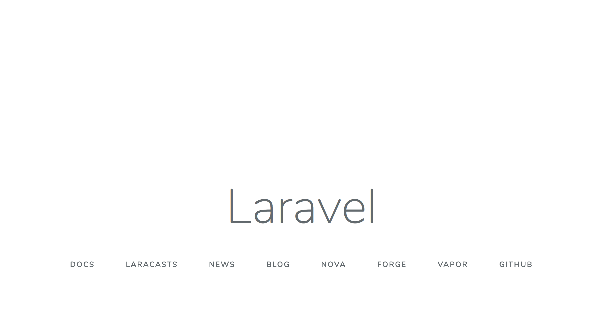

# Laravel 7 Docker Development Template
This report contains a set of files that can be used to dockerize and develop a Larvel 7 application.
I've used a PHP 7.4 container along with a MySQL 5.7 container.

## Setup
0. Copy the [./app/.env.example](./app/.env.example) file as ./app/.env
1. Install Docker
2. Install docker-compose
3. Allow execution privileges on the scripts to manage the containers.
```shell script
chmod +x up.sh
chmod +x shell.sh
```
4. Bring the containers online with the [up.sh](./up.sh) script
```shell script
./up.sh
```
5. Enter the PHP docker container shell with the [shell.sh](./shell.sh) script
```shell script
./shell.sh
```
6. Generate your application key
```shell script
php artisan key:generate
```
7. Navigate to the Laravel instance URL.
http://localhost:8080/

You should now see the landing page:


Done!